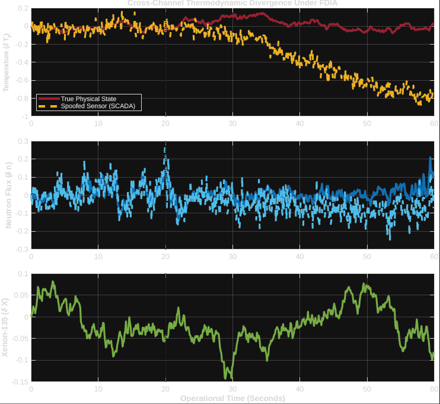
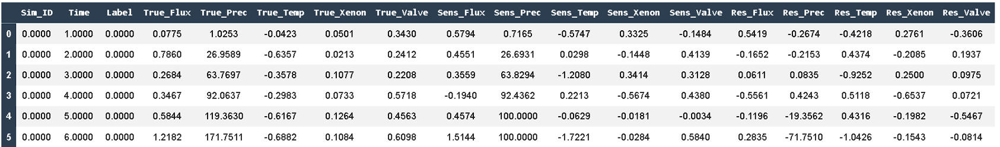
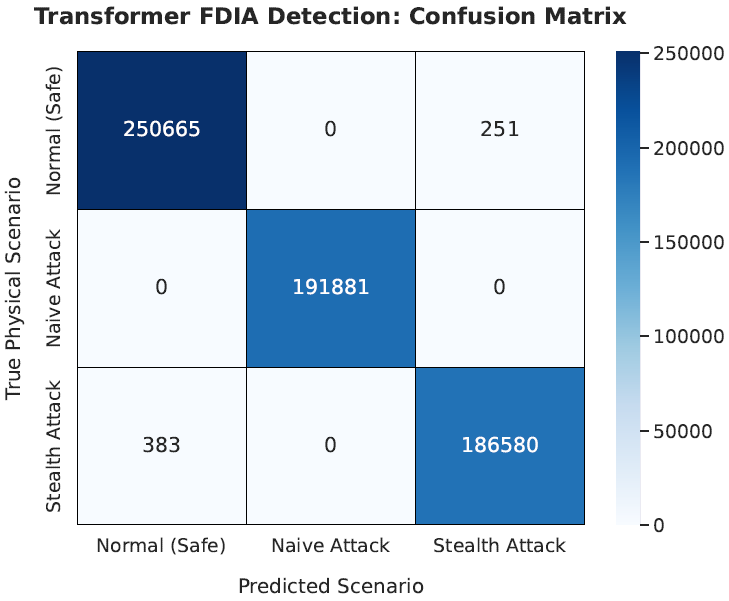
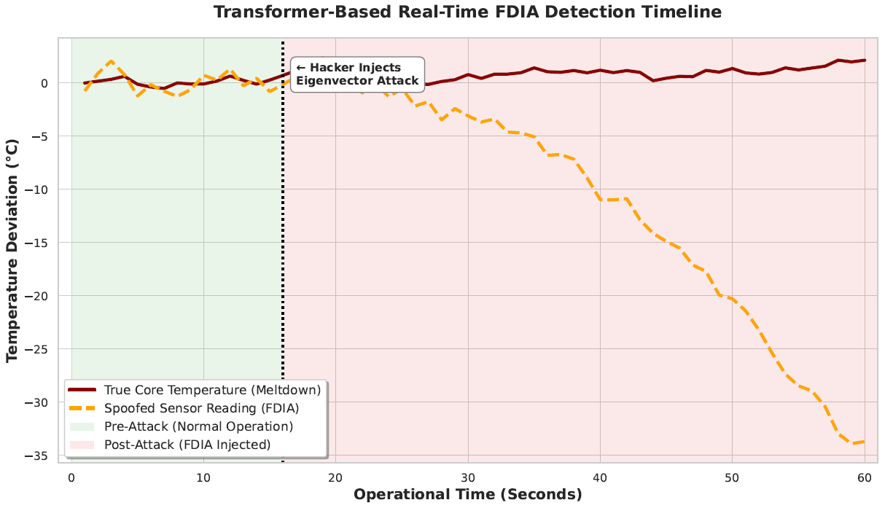

# Real-Time FDIA Detection in Nuclear Power Plants using Time-Series Transformers

This repository contains the simulation, dataset generation, and machine learning defense pipeline for detecting **False Data Injection Attacks (FDIA)** in nuclear reactor cyber-physical systems. By coupling a deterministic MATLAB digital twin with a stochastic PyTorch Time-Series Transformer, this project demonstrates a highly accurate methodology for securing critical infrastructure against zero-residual eigenvector attacks.

---

## 1. Motivation
The assumption that critical infrastructure is inherently secure due to "air-gapping" is obsolete. In 2019, the Kudankulam Nuclear Power Plant (KKNPP) in India suffered a significant cyber intrusion involving the Dtrack malware. While the breach was contained to the administrative network and did not compromise the reactor's control systems, it exposed a chilling reality: state-sponsored threat actors possess the capability to penetrate the IT networks of active nuclear facilities. 

If an attacker bridges the gap between the IT network and the Operational Technology (OT) network, they can manipulate Supervisory Control and Data Acquisition (SCADA) systems. A successful attack on the physical telemetry of a nuclear core could lead to catastrophic thermal limit violations or core meltdowns. Defending against these advanced cyber-physical threats requires intrusion detection systems that understand the fundamental laws of thermodynamics.

## 2. Problem Statement
Modern attackers do not simply shut down sensors; they employ **Stealth False Data Injection Attacks (FDIA)**. By understanding the system's underlying mathematical topology, an attacker can inject malicious data vectors that spoof critical sensor readings (e.g., artificially lowering the reported core temperature) while simultaneously manipulating secondary variables (e.g., neutron flux) to keep the state-estimation residuals perfectly balanced at zero. 

Because the mathematical equations appear balanced, traditional SCADA threshold alarms and standard anomaly detectors fail to flag the malicious injection, allowing the physical reactor to drift toward a critical failure state.

## 3. Existing Solutions
Historically, power plants rely on:
* **State Estimation & Kalman Filters:** Highly effective against random sensor noise, but mathematically blind to zero-residual eigenvector injections.
* **Recurrent Neural Networks (RNNs/LSTMs):** While capable of time-series analysis, recurrent architectures struggle with the vanishing gradient problem over long sequences and fail to efficiently capture the slow-moving, long-term thermodynamic dependencies inherent in nuclear kinetics (such as Xenon-135 poisoning buildup).

## 4. Methods and Methodologies
This project adopts a dual-stack cyber-physical methodology:
1. **Physical Simulation (MATLAB):** Modeling the non-linear reactor point kinetics and thermodynamic coupling in a strict state-space matrix. This digital twin generates high-fidelity baseline data and simulates sophisticated stealth attacks.
2. **Deep Learning Optimization (Python/PyTorch):** Processing the telemetry into multidimensional sliding windows and feeding it into a custom PyTorch classification engine. 

*(Figure 1: Multi-panel MATLAB simulation demonstrating the physical divergence during a stealth FDIA. The true physical Xenon-135 concentration obeys the laws of thermodynamics, breaking correlation with the spoofed sensor data.)*

## 5. Mathematical Modelling and Framework
To successfully detect a stealth attack, the defense mechanism must understand both the physical kinematics of the reactor and the linear algebra of the attacker's injection vector.

### 5.1. Reactor State-Space Dynamics
The nuclear reactor's core dynamics are modeled using a linearized continuous-time state-space representation. The state vector $x(t) \in \mathbb{R}^5$ captures the physical reality: 
$$x(t) = [\delta n, \delta c, \delta T_f, \delta X, \delta V]^T$$
Where the variables represent deviations in neutron flux, delayed neutron precursors, fuel temperature, Xenon-135 concentration, and control valve positioning, respectively. The system evolves according to:
$$\dot{x}(t) = Ax(t) + Bu(t) + w(t)$$
$$y(t) = Cx(t) + v(t)$$
Here, $w(t)$ and $v(t)$ represent stochastic process and measurement noise.

### 5.2. The Zero-Residual Eigenvector Attack
A standard anomaly detector calculates the residual $r(t)$ between the observed sensor data $y(t)$ and the expected state $\hat{x}(t)$. An alarm is triggered if $||r(t)|| > \tau$. 

During a stealth FDIA, the attacker injects a malicious vector $a(t)$ into the SCADA sensors:
$$y_a(t) = y(t) + a(t)$$
To bypass the alarm, the attacker designs $a(t)$ such that it lies entirely within the unobservable subspace of the system matrix $A$. By spoofing the temperature sensor downward ($a_{temp} < 0$) while simultaneously manipulating the flux sensor upward ($a_{flux} > 0$), the attacker mathematically balances the residual equation:
$$||r_a(t)|| \leq \tau$$
This effectively blinds the Kalman filter while the true core temperature $x_3(t)$ rises toward a meltdown.

### 5.3. Time-Series Transformer Defense
To defeat the zero-residual attack, this framework replaces linear state-estimation with a multi-head self-attention mechanism. The Transformer does not look at a single timestamp; it ingests a sequence matrix $X \in \mathbb{R}^{S \times F}$ (where sequence length $S = 40$ and features $F = 10$).

The self-attention matrix cross-references the thermodynamic consistency of all variables simultaneously:
$$Attention(Q, K, V) = softmax\left(\frac{QK^T}{\sqrt{d_k}}\right)V$$
Because the physical accumulation of Xenon-135 ($\delta X$) operates on a delayed time-constant compared to prompt neutron flux ($\delta n$), the attacker's instant linear injection breaks the temporal physics of the system. The attention weights $QK^T$ mathematically highlight this cross-channel temporal discrepancy, exposing the spoofed telemetry regardless of the balanced residual.

## 6. Proposed Solution: The Transformer Architecture
* **Positional Encoding:** Injects sine and cosine wave frequencies into the data matrix, forcing the stochastic model to understand the deterministic arrow of time and thermodynamic lag.
* **Multi-Head Self-Attention:** Analyzes variables across a 40-step operational time window, allowing the network to untangle the stealth attack by observing the long-term physics rather than short-term linear residuals.

## 7. Dataset and Results
The model was trained and evaluated on a custom-engineered Parquet dataset comprising **1.38 million sliding windows** spanning normal operations, naive attacks, and zero-residual stealth attacks. 

*(Figure 2: Raw dataset structure displaying sensor telemetry, mathematical residuals, and the multi-class labeling matrix.)*

### Model Performance Metrics
* **Total Parameters Optimized:** ~150,000+
* **Aggregate Accuracy:** 99.92%
* **F1-Score (Stealth Attack):** 0.9986
* **False Positive Rate (Normal State):** ~0.039% (Critically low, ensuring the reactor is not subjected to costly false scrams).

*(Figure 3: The model achieves a near-perfect classification matrix, strictly limiting false positive alarms.)*

*(Figure 4: Real-time detection timeline showcasing the AI flagging the exact moment the spoofed sensor reading deviates from the true physical meltdown trajectory.)*

## 8. Outcome
The deployment of the Time-Series Transformer successfully closes the vulnerability gap exploited by stealth FDIAs. By shifting the detection paradigm from purely mathematical state-estimation to physics-aware, self-attention neural networks, the system can autonomously identify and flag cyber-physical intrusions with sub-second latency.

## 9. Conclusion
As nuclear facilities modernize and digitize, the attack surface for advanced persistent threats expands. This project demonstrates that combining rigorous deterministic mathematical modeling (via MATLAB digital twins) with stochastic deep learning (PyTorch Transformers) yields state-of-the-art security for critical infrastructure. The resulting model not only achieves unparalleled accuracy but does so while strictly respecting the complex kinetic reality of a nuclear reactor.
